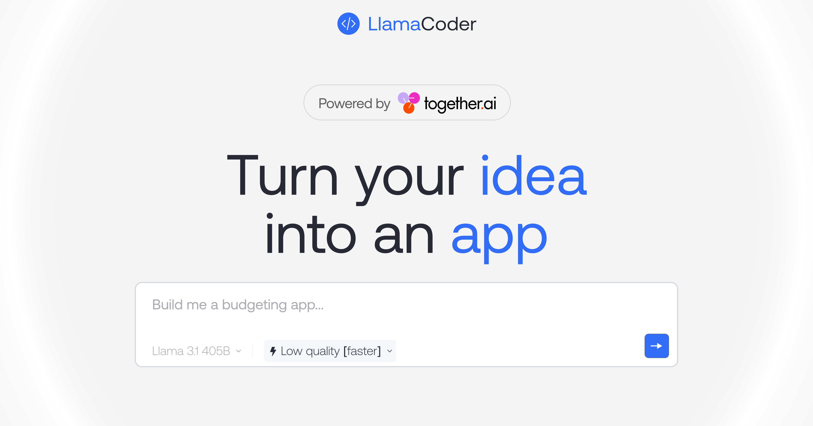

# CodeWix

Vibecoding website and app creation powered by Z.AI.

<p align="center">
  
  <h1 align="center">CodeWix</h1>
</p>

<p align="center">
  An open source AI app builder — generate small apps with one prompt. Powered by Z.AI models.
</p>

## Tech stack

- [Z.AI](https://z-ai.cn) for LLM inference (GLM 5.2, Kimi K2.7 Code, and more)
- [esbuild-wasm](https://github.com/evanw/esbuild) + [esm.sh](https://esm.sh) for the in-browser preview renderer (runs in a sandboxed iframe)
- Next.js app router with Tailwind
- [Cloudflare Pages](https://pages.cloudflare.com/) for deployment
- [Braintrust](https://www.braintrust.dev/) for observability
- Plausible for website analytics

## Cloning & running

1. Clone the repo: `git clone https://github.com/mfssecrets/CODEWIX.git`
2. Create a `.env` file and add your API keys:
   - **Z.AI API key**: `ZAI_API_KEY=<your_zai_api_key>`
   - **Database URL**: Use [Neon](https://neon.tech) to set up your PostgreSQL database and add the Prisma connection string: `DATABASE_URL=<your_database_url>`
   - **Braintrust API key** (optional, for observability): `BRAINTRUST_API_KEY=<your_braintrust_api_key>`
3. Run `pnpm install` and `pnpm dev` to install dependencies and run locally

## Deploying to Cloudflare Pages

```bash
pnpm build:cf        # Build for Cloudflare
pnpm preview:cf      # Local preview with wrangler
pnpm deploy:cf       # Deploy to Cloudflare Pages
```

Or connect the GitHub repo in the Cloudflare Dashboard and set:
- Build command: `pnpm build:cf`
- Output directory: `.open-next/worker`

## Contributing

For contributing to the repo, please see the [contributing guide](./CONTRIBUTING.md)
